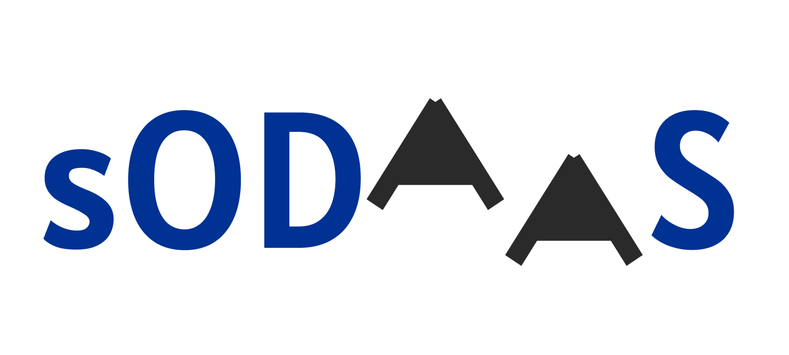

# App Team sODAAS

[](LICENSE)


no introduction  

## Description  

no description  



## Table of Contents

- [Getting Started](#Getting-Started)
- [Launch Application](#Launch-Application)
- [Contributing](#Contributing)
- [License](#License)  

## Getting Started    

```bash
git clone https://github.com/HaDock404/app-web-sodaas.git
cd app-web-sodaas
npm install
```  

## Launch Application    

```bash
npm start
```  

## Contributing

Pull requests are welcome. For major changes, please open an issue first
to discuss what you would like to change.

Please make sure to update tests as appropriate.

## License  

This project is licensed under the Creative Commons BY-NC License - see the [LICENSE](./LICENSE) file for details.